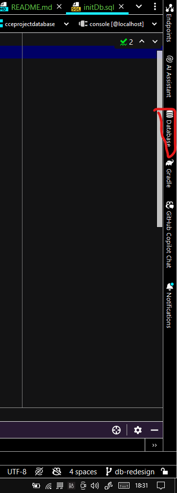
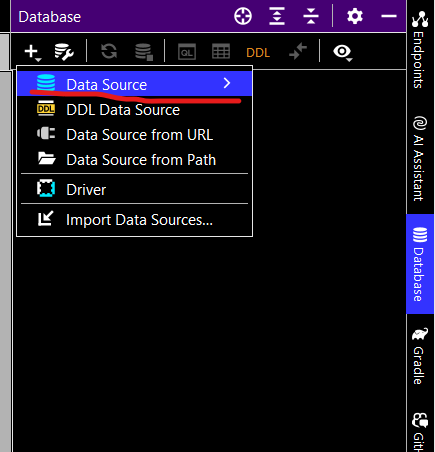
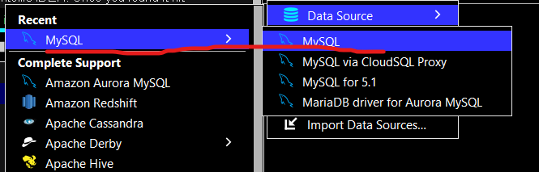
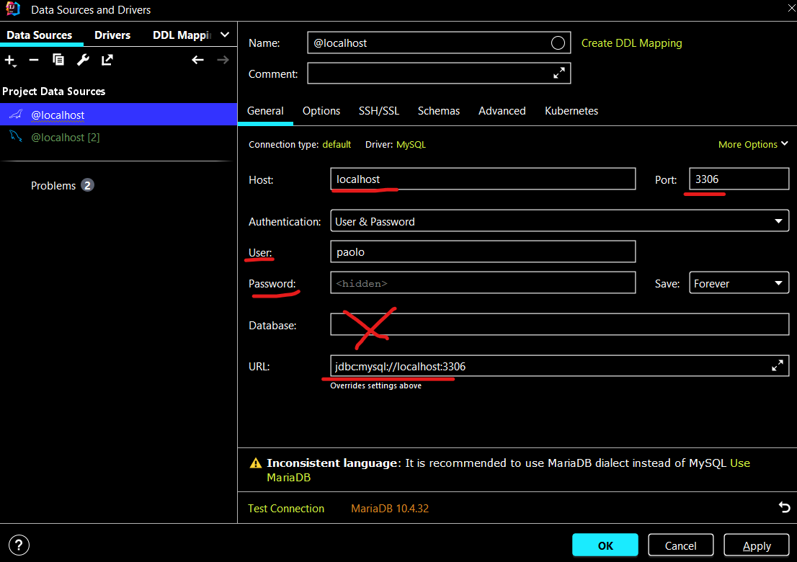
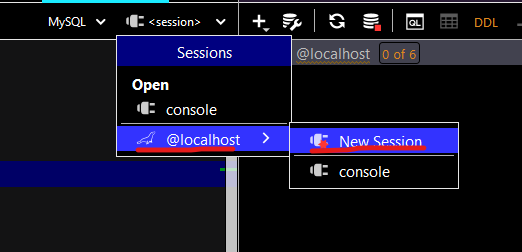
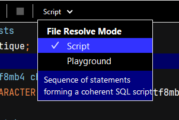
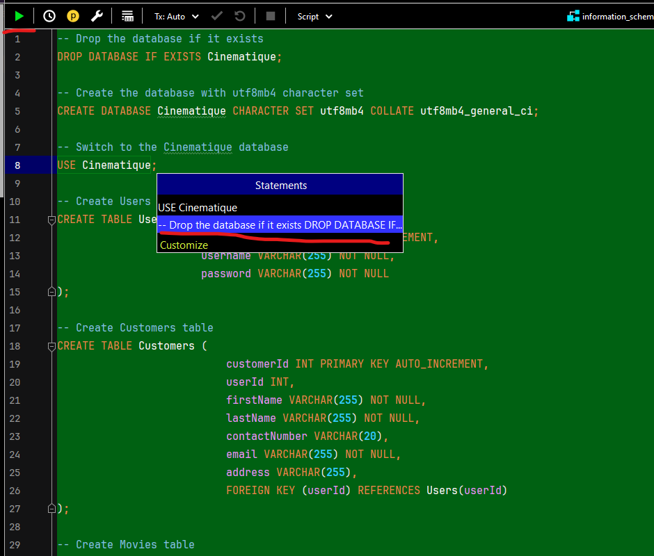
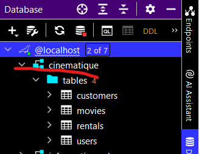
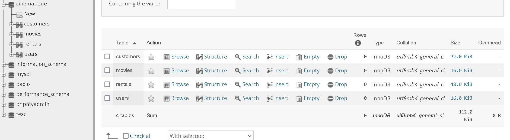

# Setting Up MySQL Database for Java Application in IntelliJ IDEA

1. **Locate Databases in IntelliJ IDEA:**
    - Find the Databases tab and click on it.
      

2. **Add a Data Source:**
    - Hit the "Add Data Source" button.
      

3. **Choose MySQL:**
    - Select MySQL from the available options.
      

4. **Configure MySQL:**
    - Fill in the necessary details, leaving the database name blank for now.
      

5. **Initiate `initDb.sql`:**
    - Open your `initDb.sql` file and configure the session by selecting the localhost data source.
    - Create a new session for the local touch.
      

6. **Choose Script and Execute:**
    - Select Script as your File Resolve.
    - Execute the entire SQL statement using either Control + Enter or the UI button.
    - Ensure your SQL is running smoothly before execution.
      

7. **Execute SQL Statement:**
    - Hit the Execute button or use the shortcut (Control + Enter) to run the SQL statement.
    - Double-check that your SQL is up and running before executing.
      

8. **Congratulations!:**
    - You did it! Your database is initialized and ready.
    - 
    - 

